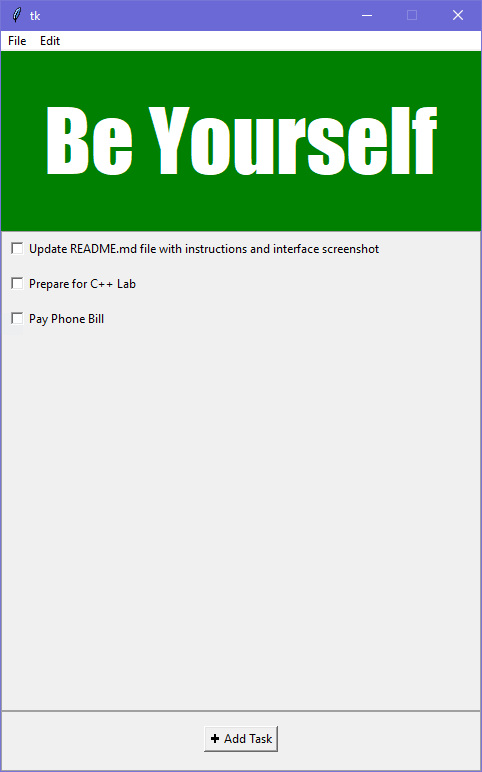

# Checklist Program
The purpose of this checklist program is to provide a simple way of listing tasks that need to be done and checking them off as they are completed.

## General Information
* This program is written entirely in Python and uses the Tkinter module
* The target operating system for this program is Windows
* Changes made to the tasks list and banner color are preserved even after the program is closed

## Running the Program for the First Time
There are two steps to running the program. First the config file needs to be generated which can be done by running the *create_default_config.py*. This can be easily done by running the following in a terminal window:
```
python create_default_config.py
```
This will generate the *config.ini* file which contains the configurations for the banner of the program such as the text, color, font, etc. Next, to actually run the program, perform the following in a terminal window:
```
python main.py
```

## Initial Design
The UI mockup created before starting this project is shown below:  


## Current User Interface
The current user interface of the program is as follows:  
  
At the top there is a simple menu bar which allows you to add tasks and change the background color of the banner. All added tasks appear in the body of the program. Note that when the program is ran for the first time there will be no pre-existing task items. The ones presented here are simply for demonstration purposes.
There are three ways to add a task:
1. Clicking the "+ Add Task" button at the bottom of the interface
2. From the menu bar you can click: File -> Add Task
3. Using the keyboard shortcut CTRL+N